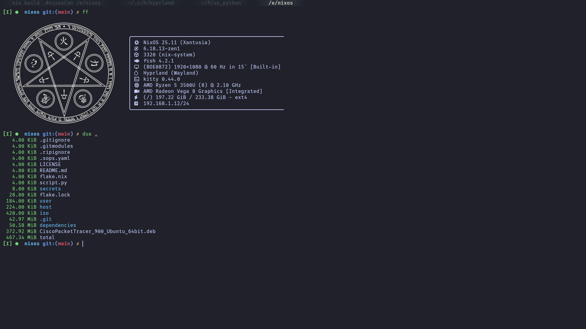

## 📁 File Structure
- [📜 flake.nix](flake.nix) — configuration entry point
- [💻 host](host) — system configuration tool entry point
  - [🛠️ scripts](host/scripts)
  - [🔧 services](host/services) — system servcies
  - [⚙️ settings](host/settings) — garbage-collector, cache, features
  - [📦 soft](host/soft) — fonts, packages, virtualization
    - [🌐 programs](host/soft/programs) — packages via options
  - [🧩 system](host/system) — file system, swap
  - [👥 users](host/users) — user settings
- [👤 user](user) — user configuration tool entry point
  - [💭 hyprland](user/hyprland) — not configured via .nix yet
  - [</> programs](user/programs) — declarative program customization
    - [🐚 fish](user/programs/fish) — aliases, functions, plugins
    - [🪛 nh](user/programs/nh) — NixOS management utility
  - [💬 services](user/services) — settings up services such as hyprpaper, mako (notifications)
  - [🎨 stylix](user/services) — theme managemant utility
- [🧩 dependencies](dependencies) — dependent files
  - [✉️ fonts](dependencies/fonts)
  - [⾕ from_home](dependencies/from_home) — files from home direcotory
  - [</> git](dependencies/git) — rewriting output of some git commands (git ref{,log})
  - [💭 hypr](dependencies/hypr) — submodule for hyprland configuration
  - [📝 n](dependencies/n) — submodule for neovim configuration
  - [🐚 qs](dependencies/qs) — submodule for quickshell configuration
  - [🐱 kitty](dependencies/kitty) — submodule for kitty configuration
  - [🎥 images](dependencies/images)

> [!NOTE]
> Why Hyprland, Neovim, Kitty, Quickshell are not configured via nix and included as submodules in the repository?
>
> I prefer fast dynamic configuration, which is impossible by implementing it through regular rebuild of home-manager after each change

## ✨ Desktop Preview
> [!TIP]
> Fastfetch

> [!TIP]
> Neovide

## 📦 Software
| Soft     | Name                                                          |
|----------|---------------------------------------------------------------|
| OS       | [NixOS](https://nixos.org)                                    |
| WM       | [Hyprland](https://hypr.land)                                 |
| Theme    | [Stylix](https://nix-community.github.io/stylix)              |
| Editor   | [Neovim](https://neovim.io/)                                  |
| Bar      | [Quickshell](https://github.com/quickshell-mirror/quickshell) |
| Terminal | [Kitty](https://sw.kovidgoyal.net/kitty/)                     |
| Shell    | [Fish](https://fishshell.com/)                                |

