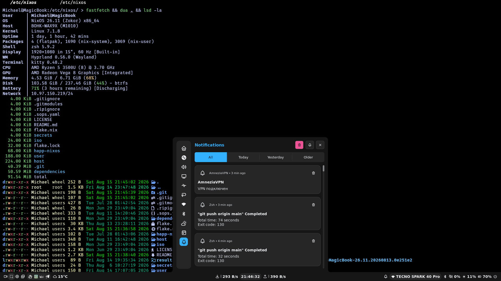
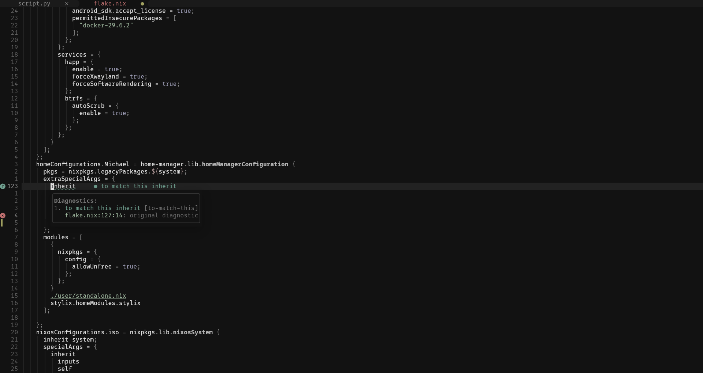

# NixOS Configuration

Declarative NixOS + Home Manager configuration for a Hyprland-based desktop.

## Key Technologies

| Category   | Tool                                                        |
|------------|-------------------------------------------------------------|
| OS         | [NixOS](https://nixos.org) (unstable)                       |
| Flake      | [Home Manager](https://github.com/nix-community/home-manager), [Disko](https://github.com/nix-community/disko), [SOPS-Nix](https://github.com/Mic92/sops-nix), [NUR](https://github.com/nix-community/NUR) |
| Desktop    | [Hyprland](https://hypr.land), [Noctalia](https://noctalia.dev/) bar, [Stylix](https://github.com/danth/stylix) theming |
| Editor     | [Neovim](https://neovim.io)                                 |
| Terminal   | [Kitty](https://sw.kovidgoyal.net/kitty/)                   |
| Shell      | [Zsh](https://en.wikipedia.org/wiki/Z_shell)                |
| Browser    | [Zen Browser](https://zen-browser.com/)                     |

## Architecture

The configuration is split into three top-level directories:

- **`host/`** — NixOS system-level configuration: boot, disk layout (Disko), networking, services, packages, secrets (SOPS), users, and system settings.
- **`user/`** — Home Manager user-level configuration: program dotfiles, services (Hyprpaper, Mako), Stylix theme, shell setup, and user config symlinks (`user/scripts/.config/`).
- **`dependencies/`** — External assets: wallpapers and screenshots.

The entry point is `flake.nix`, which defines three configurations:

| Configuration          | Purpose                                        |
|------------------------|------------------------------------------------|
| `nixosConfigurations.MagicBook` | Main NixOS system with Home Manager |
| `homeConfigurations.Michael`    | Standalone Home Manager (for non-NixOS use)  |
| `nixosConfigurations.iso`      | Minimal installation ISO                      |

## Config Deployment

Tools like Hyprland, Neovim, Kitty, and Fastfetch are configured via their native config files in `~/.config/`, not through Nix modules. On a fresh install, these configs are deployed from `user/scripts/.config/` to `~/.config/` by an activation script — only if the target directories do not already exist. Your live config is never overwritten.

System-level configs like keyd live in `host/scripts/etc/` and are symlinked to `/etc/` via a NixOS activation script.

## Desktop Preview

## Secrets

Encrypted with [SOPS-Nix](https://github.com/Mic92/sops-nix) using age. Secrets are stored in `secrets/secrets.yaml` and decrypted at boot time using the host SSH key.

## License

[Unlicense](LICENSE) — public domain.
